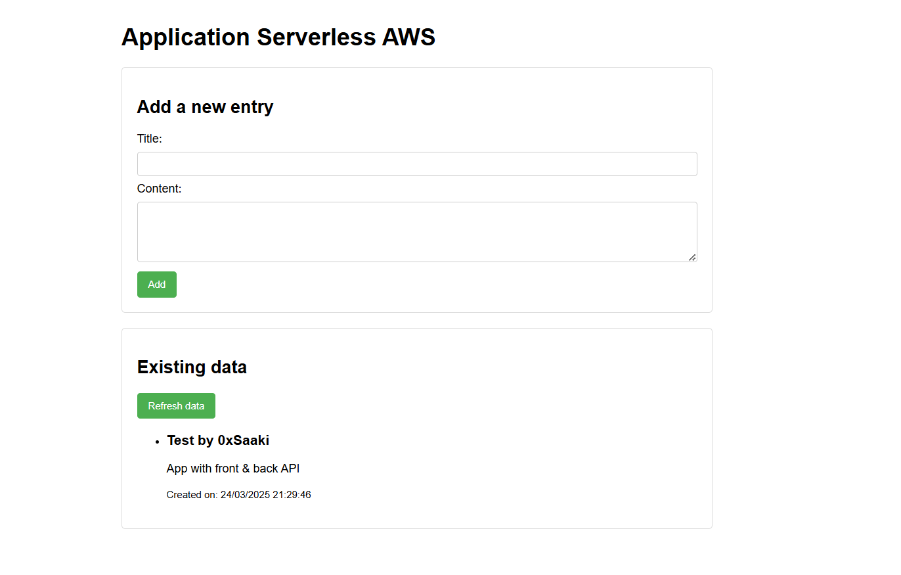

# AWS Serverless Application with Terraform

A complete serverless web application built on AWS using Terraform for infrastructure provisioning. This project demonstrates how to create a modern cloud-native application with a static frontend, serverless backend, and NoSQL database.

## Architecture

The application follows a serverless architecture pattern:
- **Frontend**: Static website hosted on Amazon S3
- **API Layer**: Amazon API Gateway exposing REST endpoints
- **Backend Logic**: AWS Lambda functions written in Node.js
- **Database**: Amazon DynamoDB (NoSQL)
- **Infrastructure as Code**: Defined with Terraform

## Features

- Display existing data entries
- Add new entries with title and content
- Persistent data storage in DynamoDB
- Complete serverless architecture with no servers to manage

## Technologies Used

- **AWS S3**: Frontend hosting
- **AWS Lambda**: Serverless compute
- **AWS API Gateway**: REST API management
- **AWS DynamoDB**: NoSQL database
- **Terraform**: Infrastructure as Code
- **Node.js**: Runtime for Lambda functions

## Project Structure

```
├── terraform/          # Terraform configuration files
│   ├── providers.tf    # AWS provider configuration
│   ├── variables.tf    # Input variables
│   ├── s3.tf           # S3 bucket for frontend
│   ├── dynamodb.tf     # DynamoDB table
│   ├── lambda.tf       # Lambda functions
│   ├── api_gateway.tf  # API Gateway configuration
│   ├── iam.tf          # IAM roles and policies
│   └── outputs.tf      # Output values
├── frontend/
│   └── public/         # Static website files
│       ├── index.html  # Main page
│       ├── error.html  # Error page
│       └── app.js      # Frontend JavaScript
└── backend/
    └── functions/      # Lambda function code
        ├── getData.js  # Function to retrieve data
        ├── postData.js # Function to create data
        └── package.json # Dependencies
```
## Screenshots



## Deployment Instructions

### Prerequisites
- AWS CLI configured with appropriate credentials
- Terraform installed (v1.0.0+)
- Node.js installed (v14.0.0+)

### Steps

1. **Initialize Terraform**
   ```
   cd terraform
   terraform init
   ```

2. **Apply Terraform configuration**
   ```
   terraform apply
   ```

3. **Deploy frontend**
   ```
   aws s3 sync ../frontend/public/ s3://YOUR-BUCKET-NAME/
   ```

4. **Update API URL in frontend**
   - Update the `apiUrl` in `frontend/public/app.js` with the API Gateway URL from Terraform outputs
   - Re-sync the frontend files to S3

## Challenges and Solutions

### CORS Configuration
The project required proper CORS (Cross-Origin Resource Sharing) configuration to allow the S3-hosted frontend to communicate with the API Gateway. This was resolved by configuring appropriate CORS headers in both API Gateway and Lambda responses.

### Lambda Dependencies
Lambda functions required external dependencies like the UUID package. The solution involved creating a deployment package that includes both the function code and its dependencies in node_modules.

## Future Enhancements

- User authentication with Amazon Cognito
- HTTPS support with CloudFront
- Data validation and error handling
- Edit and delete functionality
- Enhanced UI with CSS frameworks

## License

MIT
